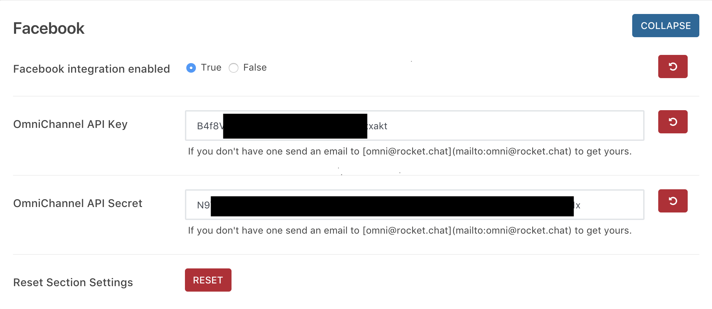
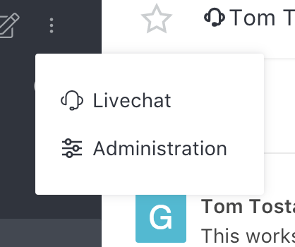

# Integrating Livechat with Facebook Messenger

If your organization wishes to communicate with users of Facebook Messenger, you can enable an integration within Rocket.Chat to do so. First, you will need to request an API key from Rocket.Chat Support, then set it up within your Administration area.

## Requesting an API key

Send an email to [omni@rocket.chat](mailto:omni@rocket.chat) to request an API key. These are processed as time allows, and may take a few days, but you should have your key and secret soon enough.

## Setting up the integration

1. In Administration, select Livechat and enable it if it isn't already.
2. On that same page, find the Facebook section. Enable the Facebook integration and enter your Key and Secret. Save the changes. 
3. Return to the main Rocket.Chat interface. Under the same disclosure button where you find Administration, you'll now see Livechat settings. Click on it. 
4. Select Facebook Messenger and click Enable. You'll be prompted to log in. Be sure to use the credentials that are tied to the page you wish to receive messages from. You'll have to do a standard Facebook OAuth login and grant your Rocket.Chat instance access to your pages.
5. Once you're returned from Facebook you'll see a list of the pages associated with that account. If you see none, make sure that account has pages, then click RELOAD PAGES.
6. Enable the pages you'd like to get messages from. 
7. Return to the main interface. Now any livechat agents you have \(These can be set from those same Livechat settings you were just in under User Management\) will see any incoming chats from that page. Responses go back to Facebook as if you were using Messenger itself.

