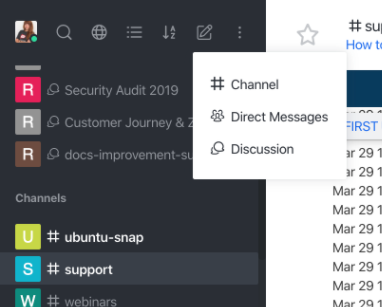
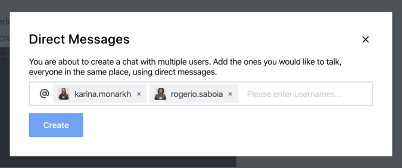
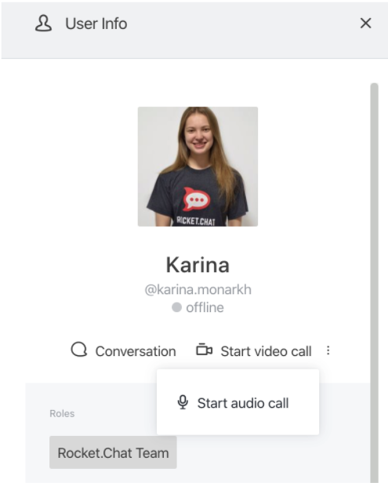
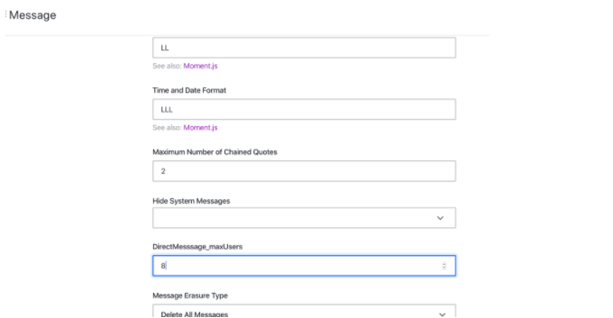

# Direct messages between multiple users

The feature allows the creation of direct message rooms between several users to exchange messages and files.

Unlike creating [**private groups**](channels.md), you do not need to specify the name or topic of the conversation; and you do not have to decide whether the room is read-only.

It works just like regular direct 1:1 messaging, the only difference is that multiple users are involved.

## How to create the multi-users direct message room

Find the Create button in the top menu of your workspace. Click create, select Direct Messages:

Choose who you want to add to the direct message room:

Once created, the room will appear in the direct message section of the rooms list on the left \(if you sort by type\):

## Configurations

Multi-users direct message rooms’ actions and options remain the same as in [**direct \(1-on-1\) messages**](channels.md), except for the ability to execute actions like: ignore, mute, block or remove.

The only user actions available are:

* ability to make an audio call with the user
* jump to a direct chat with them

## Administration

As administrator, you can configure the maximum number of participants allowed in a direct message room \(globally\).

Look under **Administration -&gt; Message**:

Our recommendation is a maximum of 8 users, but you can change the limit for your own needs.

**Important**: Since direct messages between multiple users are still a type of direct messages, for the first version of this feature, we decided to keep the same behaviors as a simple direct message as much as possible.

We have established a few rules to mimic this behavior:

* You cannot create multiple direct message rooms with the same users combination;
* You cannot change the room's name;
* There is no description or topic fields;
* You can not invite users for a pre-existing room  \(once created, the membership of the room CANNOT change\);
* You can not kick users from the direct messages room;
* There is no owner \(unlike channels\);
* It's not possible to delete the room, delete will **ONLY** hide the conversation **FOR YOU** \(since there is no owner\);
* If you want to delete somebody from the conversation, create a new direct messages room without that participant. Same goes to adding a user to the room  \(there is currently no shortcut to this, you must respecify all the participants you want in the room\).
* Rocket.Chat allows user deletion, in this case, the messages from the deleted user will be gone, but the room will be preserved.

